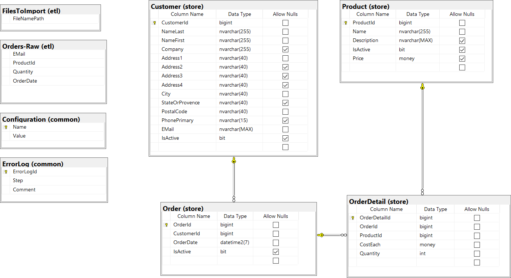

# Resiliancy

A demo of how to be resilient

## Demo Web Service

1. We have controllers demoing how to do resiliancy in ADO.NET, Entity-Framework, and HttpClient

2. Run the webapi and look at the demos

3. Read the comments that start with `// SEE:` to see resiliancy in action

## SQL Scripts

Please have `Docker` Running.

In `scripts/` there are the following scripts

* sql-start.sh - starts sql server and mounts the demo `data` directory as `/data` and restores the "Bicycle" database
* sql-stop.sh - stops sql server and tears container down
* sql-cmd.sh - Opens a SQL prompt on the container  
* sh-cmd.sh  - Opens a BASH shell on the container

## Bicylce SQL Database

The SQL Demos use the Blitzkrieg Bicycle Demo. 

## Restore SQL Linux

You don't need to run this but it is here for completeness, see: `data/Restore.sql` and `data/Bicycle.bak`

## Demo REST endpoint to call

This exellent endpoint is just the thing to demo how to use `HttpClientFactory` properly.

http://dummy.restapiexample.com/

